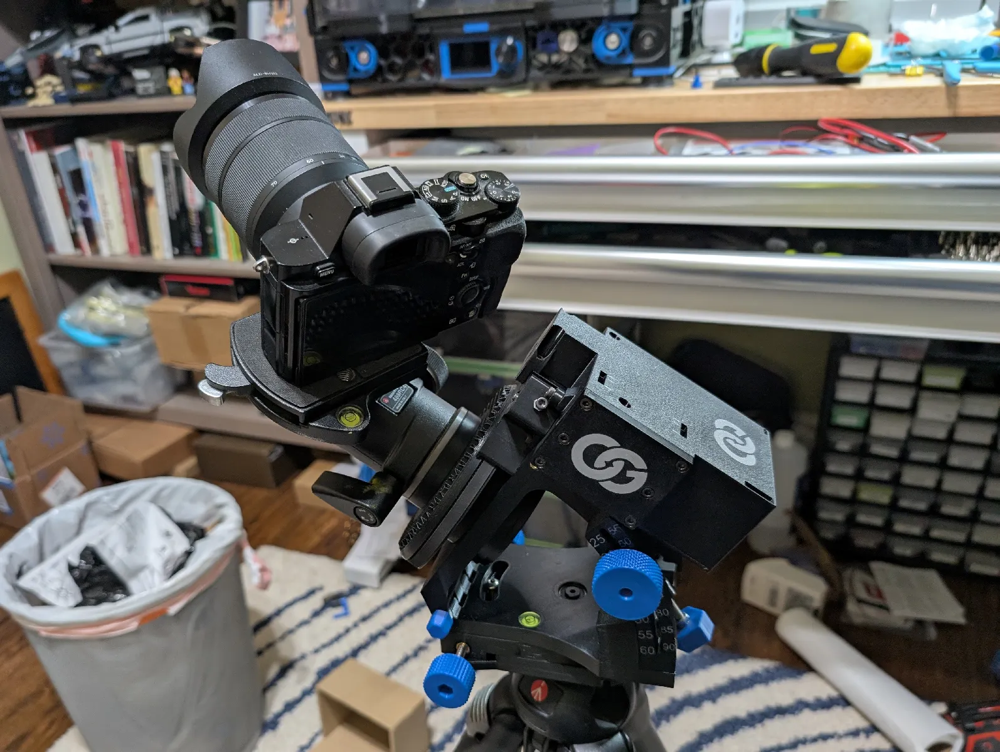
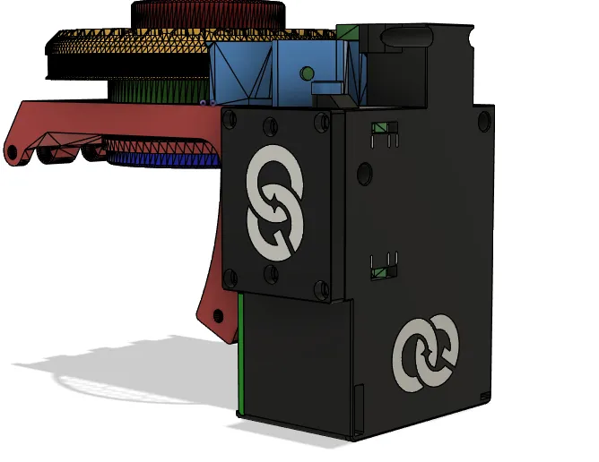

## Surveyor Tripod Adapter

| Front | STL |
| --- | --- |
|  |  |

### Intro:
These are a few mods to the excellent design of the OG Star Tracker V2.  After building it initially, I wanted to make a few changes to the gearbox to make it a little beefier and make a few small aesthetic changes.  

### Changes impacting strength
- Combines gearbox part 1 and part 2 into one piece for a cleaner look and improved rigidity.
- Thickens the back face of the combined part 1 and 2 for extra rigidity.
- Adds additional bracing to the 625 bearing mount that the tightener pulls against.
- Thickens the mount for the NEMA 17 stepper.  
- Adds additional mounting point for the belt cover to keep it from lifting when pushing against the 400mm belt.

### Other Changes
- The files are now multi-material files with separate bodies for colors so you no longer have to do multi-material painting. 
- Added the logo to the [doors]
- added optional idler carriers
- added camera holder that uses a 3/8"-16 x ½" bolt versus the ¼"-20 x ½"

### Downsides
It is a little more tricky to assemble because access to a couple the bolts is slightly worse.  However, I think it is worth it.

All files are within the **stls** folder. Update will likely land first on the printables page.

Printables link: https://www.printables.com/model/1262022-og-star-tracker-v2-mods-single-piecebeefier-gearbo

Credits go to #Long from discord
