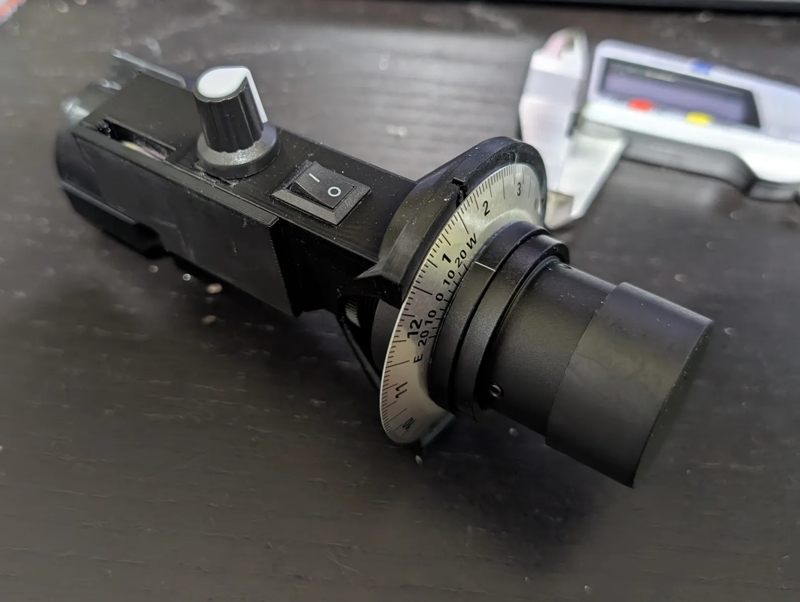
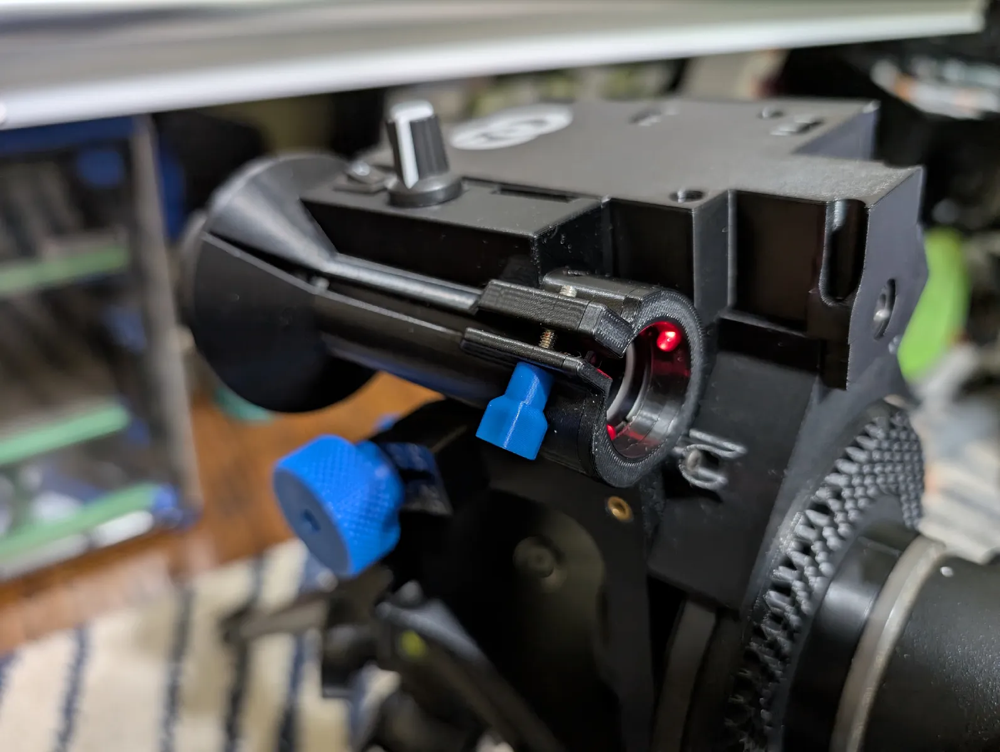

## Surveyor Tripod Adapter

| Polarscope mount | Tracker mounted |
| --- | --- |
|  |  |

### Intro:
This is a modified polar mount for the OG Star Tracker V2 that adds some LEDs.  Due to the small space constraints, it isn't the most straightforward build, but it does work pretty well once assembled.  

I used the switch and potentiometer I had on hand, which probably made it harder than just buying a potentiometer with a switch.  I will include the STEP file so it should be pretty easy to modify the electronics compartment to a a switched potentiometer if desired.

**IMPORTANT NOTE**:

This will only work with my single piece gearbox mod [here](../beefier_gearbox_multicolor/README.md) and the upcoming revision of the OG tracker, which will also combine the gearbox 1-2 pieces into a single piece.

### BOM:

- (1) - Polar Scope of this style https://www.amazon.com/dp/B0D2L11C4G 
- (2) - 3mm LEDs
- (2 ft) - >24 gauge wire. the thinner you have, the easier it will be.  I used 26g. 
    - the strands from an ethernet cable will probably work well
- (1 ft) - 20-22g wire.  
    - 20g will work if you have FEP or PTFE wire.
    - Can also use the thin gauge wire and just double/triple up the exposed wire ends.
    - This is used to make the contacts to the 2032 battery.
- (1) - 10 x 15mm mini rocker switch https://www.aliexpress.us/item/3256807801613950.html 
- (1) - WH148 5k ohm potentiometer https://www.aliexpress.us/item/2251832721838471.html 
    - Even lower than 5k is probably better, but all I see is 5k.
    - Any potentiometer that attaches with a nut will probably work as long as it is smaller than the WH148, which is actually kind of big.
- (1) - 2032 battery (3v)
- (1) - 4.2mm brass heatset (from Star Tracker BOM)
- Superglue

Printables link: https://www.printables.com/model/1293141-og-star-tracker-v2-illuminated-polar-scope-mount

The printables link also contains the detailed guide.

Credits go to #Long from discord
